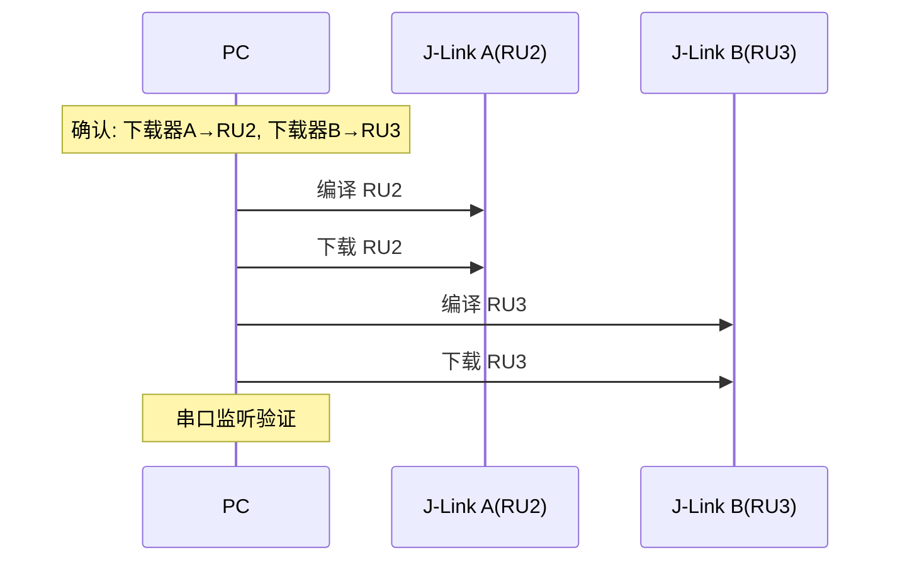

# 编译与下载

## 编译

使用 Keil UV4 命令行编译工程：

```powershell
Push-Location "<工程目录>"
cmd /c "`"C:\Keil_v5\UV4\UV4.exe`" -b <工程文件.uvprojx> -o build_log.txt"
Pop-Location
```

### 查看编译错误

```powershell
Get-Content "build_log.txt" | Select-String "error" -Context 1,0
```

## 下载

```powershell
Push-Location "<工程目录>"
cmd /c "`"C:\Keil_v5\UV4\UV4.exe`" -f <工程文件.uvprojx> -o flash_log.txt"
Pop-Location
```

## 一步编译+下载

```powershell
Push-Location "<工程目录>"
cmd /c "`"C:\Keil_v5\UV4\UV4.exe`" -b <工程文件.uvprojx> -o build_log.txt && `"C:\Keil_v5\UV4\UV4.exe`" -f <工程文件.uvprojx> -o flash_log.txt"
Pop-Location
```

## 批量编译下载多工程



批量操作也可使用 `scripts/batch_builder.py` 脚本自动完成。
