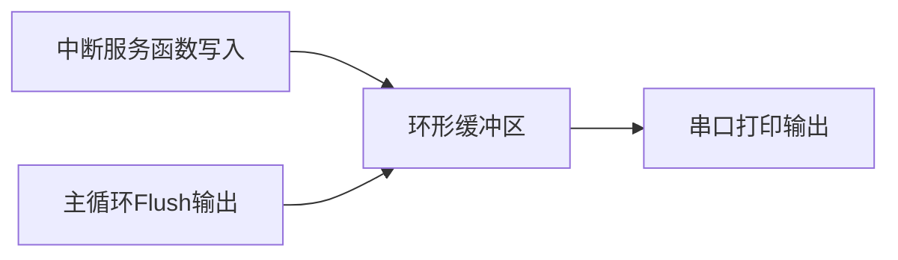

# CHESHI 调试宏统一规范

> 本文件由 SKILL.md 按需加载，描述 CHESHI 调试宏的完整规范。

---

## 强制基础规则

1. **仅使用 `CHESHI`** 作为唯一调试总开关，废弃任何独立分级宏
2. **集中定义**：所有宏定义写在 `main.c` 文件头部，调试结束直接整段删除
3. **优先 Bit 位掩码**（方案A）；项目不支持位运算时用数值分级（方案B）
4. 中断环形缓冲区打印同样统一使用该宏控制

---

## 方案A（推荐）：Bit 位掩码

模块化精准控制各模块打印开关。

### main.c 头部定义

```c
/*****************************************
 * 【临时调试宏 - 仅调试阶段启用，正式版本完整删除本段】
 * Bit位分配约定：
 * Bit0(0x01)：通用流程函数入口打印
 * Bit1(0x02)：通信原始帧HEX打印
 * Bit2(0x04)：外设驱动状态打印
 * Bit3(0x08)：业务状态机跳转打印
 *****************************************/
#define CHESHI  0x0F   // 00001111 开启全部模块
```

### 代码中使用

```c
// 通用流程打印 Bit0
#if (CHESHI & 0x01)
    printf("[COMMON] func enter, dataLen=%d\r\n", len);
#endif

// 通信原始数据打印 Bit1
#if (CHESHI & 0x02)
    printf("[COMM_RAW] PDU: ");
    for(int i=0; i<8 && i<len; i++) printf("%02X ", pucFrame[i]);
    printf("\r\n");
#endif

// 外设驱动打印 Bit2
#if (CHESHI & 0x04)
    printf("[DRV_FLASH] 操作状态=%d\r\n", flash_status);
#endif

// 状态机跳转打印 Bit3
#if (CHESHI & 0x08)
    printf("[FSM] %s -> %s (event=%d)\r\n", cur_state, next_state, event);
#endif
```

### 灵活切换

```c
#define CHESHI  0x01    // 仅通用流程
#define CHESHI  0x03    // 通用流程 + 通信帧
#define CHESHI  0x00    // 关闭所有调试打印
```

---

## 方案B（备选）：数值分级比较

用于不支持位运算的场景（如某些编译环境）。

### main.c 头部定义

```c
/*****************************************
 * 【临时调试宏 - 上线完整删除本段】
 * 分级规则：
 * CHESHI = 0 ：关闭全部调试打印
 * CHESHI ≥ 1 ：错误、关键异常打印
 * CHESHI ≥ 2 ：常规变量、流程摘要打印
 * CHESHI ≥ 3 ：完整HEX原始数据打印
 *****************************************/
#define CHESHI  3
```

### 代码中使用

```c
// 错误级打印
#if (CHESHI >= 1)
    printf("[ERR] 解析失败，错误码=%d\r\n", err_code);
#endif

// 常规信息打印
#if (CHESHI >= 2)
    printf("[INFO] 寄存器地址=%d 数量=%d\r\n", addr, cnt);
#endif

// 原始数据全量打印
#if (CHESHI >= 3)
    printf("[HEX_DATA] ");
    for(int i=0; i<len; i++) printf("%02X ", pucFrame[i]);
    printf("\r\n");
#endif
```

---

## 统一打印标签格式

所有调试打印使用统一标签前缀，便于日志过滤：

| 标签 | 含义 |
|:---|:---|
| `[COMMON]` | 通用流程入口/出口 |
| `[COMM_RAW]` | 通信原始 HEX 数据 |
| `[DRV_xxx]` | 外设驱动状态 |
| `[FSM]` | 状态机跳转 |
| `[ERR]` | 错误/异常 |
| `[INFO]` | 常规信息 |
| `[HEX_DATA]` | 完整 HEX 数据 |

---

## 中断环形缓冲区

ISR 中禁止直接 `printf`，采用缓冲区中转：

```c
#define DBG_BUF_SIZE 256
uint8_t g_dbg_buf[DBG_BUF_SIZE];
uint16_t g_dbg_wr = 0, g_dbg_rd = 0;

// 中断内写入字节
void USART3_IRQHandler(void) {
#ifdef CHESHI
    g_dbg_buf[g_dbg_wr++ % DBG_BUF_SIZE] = rx_byte;
#endif
}

// 主循环统一输出
void Debug_Flush(void) {
#ifdef CHESHI
    while (g_dbg_rd != g_dbg_wr) {
        printf("%02X ", g_dbg_buf[g_dbg_rd++ % DBG_BUF_SIZE]);
    }
#endif
}
```



---

## Keil 工程配置

如果编译时 CHESHI 打印无输出，检查 Keil 工程是否定义了 CHESHI 宏：

1. 打开工程选项（Project → Options for Target）
2. C/C++ 选项卡 → Preprocessor Symbols → Define
3. 添加 `CHESHI`（无需值，仅为启用条件编译）

AI 应自动在 Keil 工程配置中添加该定义。
