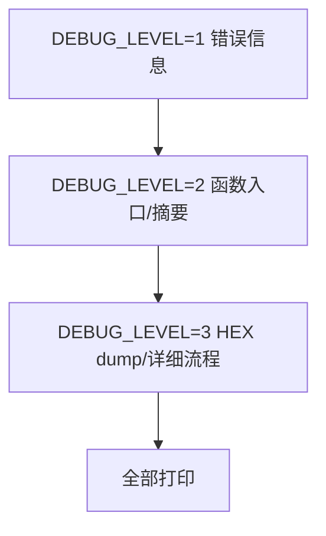

# 条件编译分层

> 当调试内容过多时，建议按级别分层控制打印量。

## DEBUG_LEVEL 三级方案

在 Keil 工程 `Define` 中设置 `DEBUG_LEVEL=N`：

```c
// DEBUG_LEVEL=1   → 只打印错误和关键信息
// DEBUG_LEVEL=2   → 打印函数入口和数据摘要
// DEBUG_LEVEL=3   → 打印原始 HEX dump 和详细流程

#if DEBUG_LEVEL >= 1
    printf("[ERR] func=0x%02X except=%d\r\n", func, except);
#endif

#if DEBUG_LEVEL >= 2
    printf("[EXEC] addr=%d cnt=%d len=%d\r\n", addr, cnt, len);
#endif

#if DEBUG_LEVEL >= 3
    printf("[HEX] ");
    for(int i=0; i<len && i<32; i++) printf("%02X ", buf[i]);
    printf("\r\n");
#endif
```

## 分层结构



> **建议**：日常开发用 `LEVEL=2`，定位疑难问题时临时调高到 `LEVEL=3`。
