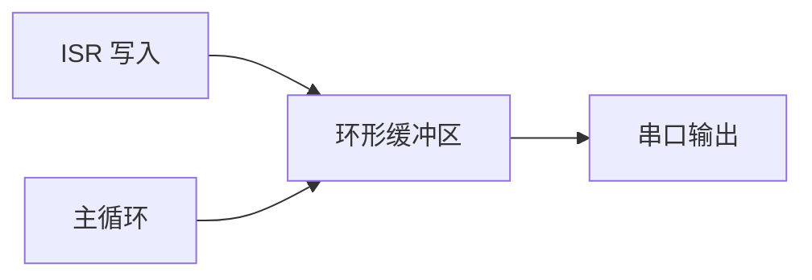

# 中断保护打印

> 在 ISR（中断服务函数）中直接使用 `printf` 可能导致卡死或丢数据。推荐使用**环形缓冲区 + 主循环输出**。

## 环形缓冲区模式

```c
// 头文件
#define DBG_BUF_SIZE 256

// 中断中写入
void USART3_IRQHandler(void) {
    // ...中断处理...
#ifdef CHESHI
    g_dbg_buf[g_dbg_wr++ % DBG_BUF_SIZE] = rx_byte;  // 只记关键字节
#endif
}

// 主循环中输出
void Debug_Flush(void) {
#ifdef CHESHI
    while (g_dbg_rd != g_dbg_wr) {
        printf("%02X ", g_dbg_buf[g_dbg_rd++ % DBG_BUF_SIZE]);
    }
#endif
}
```

## 数据流


