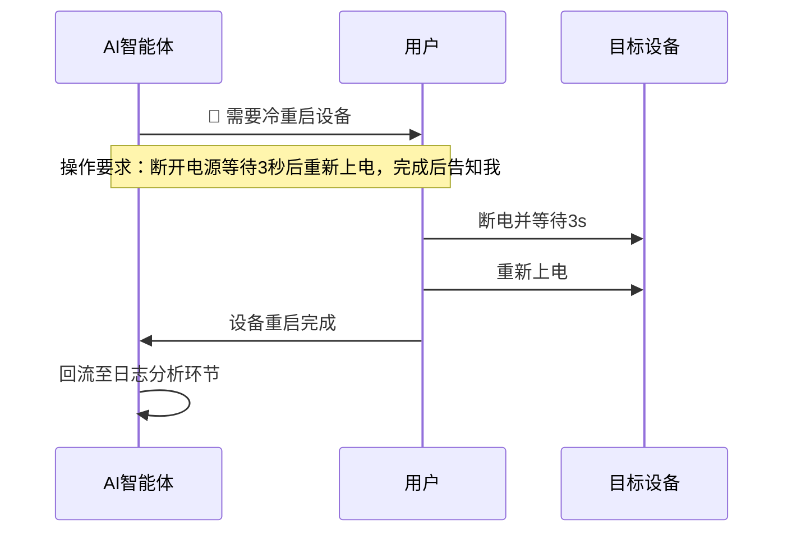

# 人工暂停场景完整操作规范

> 本文件由 SKILL.md 按需加载。仅三类场景允许暂停，其余全程静默自动执行。

---

## 暂停清单总览

| 暂停节点 | 触发判定场景 | 用户执行操作 |
|:---|:---|:---|
| **设备断电重启** | 设备死机看门狗失效、底层时钟/启动代码修改、外设锁死无法恢复 | 断开电源等待3秒后重新上电 |
| **Keil 断点调试** | 串口打印无法获取变量/寄存器/调用栈，纯日志无法定位 | 设置断点，Debug运行后反馈变量值 |
| **迭代上限求助** | 自动加打印满8轮仍无法定位故障 | 提供硬件接线、对比日志、业务逻辑说明 |

---

## 场景1：设备断电重启



**触发场景**：
- 设备卡死，看门狗失效
- 系统启动/时钟配置代码修改
- Flash 外设锁死无法恢复

**注意**：普通异常优先热复位（按复位键），不强制断电。

---

## 场景2：Keil 断点调试

### 标准化请求格式

AI 向用户发出断点调试请求时，必须包含以下完整信息：

```
🛑 需要断点调试
目标文件：mbfuncholding_m.c
目标函数：eMBMasterFuncReadHoldingRegister
断点行号：325行
待查看变量：usRegCount、usRegAddress、pucFrame[0~5]
```

### 用户操作步骤

1. 打开 Keil MDK
2. 在指定文件、指定行号设置断点
3. 进入 Debug 模式运行
4. 在 Watch 窗口查看指定变量值
5. 将结果反馈给 AI

### AI 收到反馈后

- 分析变量值是否符合预期
- 若信息不足，可请求第二次断点调试（不同位置）
- 最多申请 3 次断点调试，之后应切换策略

---

## 场景3：迭代上限求助

### 触发条件

自动 CHESHI 调试迭代满 **8 轮**，仍无法定位故障根因。

### AI 向用户输出的求助内容

```
🛑 迭代上限求助 — 已自动执行 8 轮 CHESHI 调试仍无法定位

当前状态：
- 故障现象：[简述]
- 已确认信息：[已排除的原因]
- 最后日志摘要：[最后读取的日志关键行]

为继续推进，需要您提供以下任一信息：
1. 硬件接线方式（多设备间物理链路图）
2. 对比正常设备的串口日志
3. 该模块的业务逻辑说明或协议文档
4. 能否通过 Keil 断点调试获取更多信息？
```

### 用户响应后

- 根据用户提供的信息重新分析定位
- 轮次计数器重置（新信息 = 新起点）
- 继续执行调试循环
