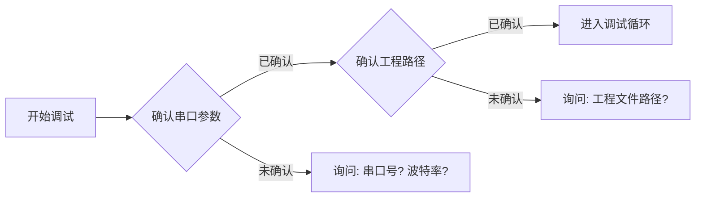

# 前置信息确认

> 每次开始调试前，必须先确认以下信息。

## 确认清单

| 项目 | 说明 | 示例 |
|------|------|------|
| 工程路径 | `.uvprojx` 文件所在目录 | `ru3_system_management1\MDK-ARM\` |
| 工程文件 | Keil 工程文件名 | `RU3.uvprojx` |
| 串口号 | 目标板调试串口 | `COM19` |
| 波特率 | 目标板调试串口波特率 | `256000` |
| 数据位 / 停止位 / 校验 | 串口参数 | `8 / 1 / None` |
| 下载器 | J-Link / ST-Link 序列号（多设备时必填） | J-Link S/N 123456 |
| 设备角色 | 设备在系统中的功能 | RU3 主机 / RU2 从机 |
| 通信链路 | 设备间的物理连接 | RU3(USART3 TTL)→RU2(USART3 TTL) |

## 确认流程



## 使用脚本配置

确认的信息应写入 `scripts/skill-config.json`，供 Python 脚本读取：

```json
{
  "keil": {
    "uv4_path": "C:\\Keil_v5\\UV4\\UV4.exe",
    "projects": [
      {"name": "RU3", "path": ".\\ru3_system_management1\\MDK-ARM", "file": "RU3.uvprojx"}
    ]
  },
  "serial": {
    "port": "COM19",
    "baudrate": 256000
  }
}
```
