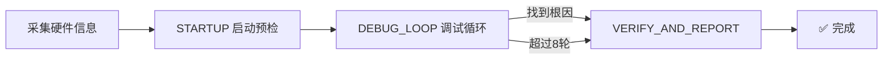

# /kzl 帮助 — 嵌入式调试工作流

> 嵌入式固件调试自动化工作流：编译烧录 → 串口日志 → CHESHI 迭代 → 故障定位 → 报告输出。

---

## 可用命令

| 命令 | 用途 |
|------|------|
| `/kzl 帮助` | 显示本帮助 |
| `/kzl 初始化 [项目目录]` | 初始化调试配置（扫描 Keil 工程、采集串口/下载器参数） |
| `/kzl 编译` | 编译当前工程并下载固件到设备 |
| `/kzl 增加流程` | 新增步骤 / 阶段（读 `refs/add-flow-guide.md`） |

---

## 快速开始

### 首次使用

```text
1. /kzl 初始化 ./        ← 在当前项目初始化配置
2. 描述故障现象并确认工程配置  ← 自动进入调试流程
```

### 后续调试

描述故障现象并确认工程配置（若配置未完，直接在 embedded-debug-config.json 中修改后点确认），AI 会自动走完 STARTUP → DEBUG_LOOP → VERIFY_AND_REPORT 流程。


---

## 工作流总览



---

## 详细文档

| 文档 | 说明 |
|------|------|
| `refs/core-rules.md` | 5 条强制规则 |
| `refs/workflow-overview.md` | 10 步完整工作流 |
| `refs/script-commands.md` | 脚本命令参考 |
| `refs/common-faults.md` | 常见故障速查 |
| `refs/cheshi-macro.md` | CHESHI 调试宏规范 |
| `refs/checklist.md` | 迭代完成检查清单 |
