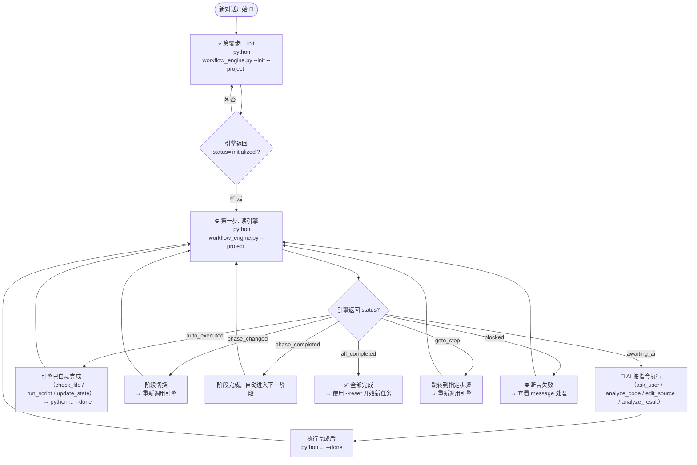
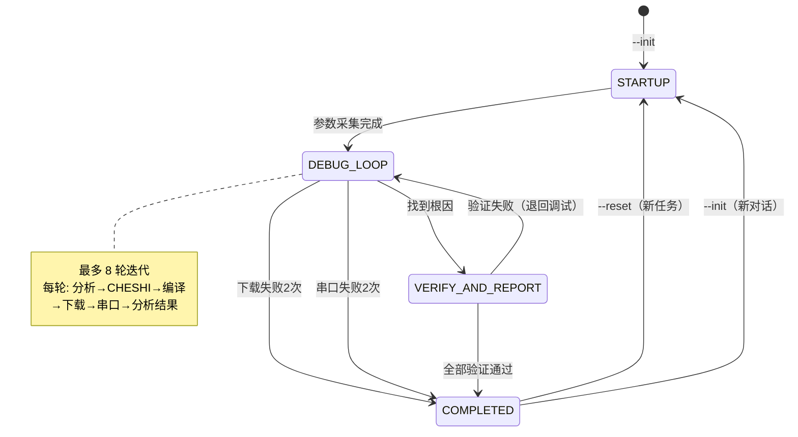

# 嵌入式调试工作流 — 完整运行流程图

## 1. AI 与引擎交互模式

```mermaid
flowchart TD
    %% ═══════════════════════════════════════════════════════════
    %% 引擎交互模式（外层驱动层）
    %% ═══════════════════════════════════════════════════════════
    Start(["新对话开始 👤"]) --> Step0["⚡ 第零步: --init
        python workflow_engine.py --init --project <dir>"]
    Step0 --> InitOk{"引擎返回
        status='initialized'?"}
    InitOk -->|✅ 是| Step1["⛔ 第一步: 读引擎
        python workflow_engine.py --project <dir>"]
    InitOk -->|❌ 否| Step0

    Step1 --> RunOk{"引擎返回 status?"}

    RunOk -->|"awaiting_ai"| AiDo["🤖 AI 按指令执行
        （ask_user / analyze_code / edit_source / analyze_result）"]
    AiDo --> AiDone["执行完成后:
        python ... --done"]
    AiDone --> Step1

    RunOk -->|"auto_executed"| AutoDone["引擎已自动完成
        （check_file / run_script / update_state）
        → python ... --done"]
    AutoDone --> Step1

    RunOk -->|"phase_changed"| PhaseNew["阶段切换
        → 重新调用引擎"]
    PhaseNew --> Step1

    RunOk -->|"phase_completed"| PhaseDone["阶段完成，自动进入下一阶段"]
    PhaseDone --> Step1

    RunOk -->|"all_completed"| AllDone["✅ 全部完成
        → 使用 --reset 开始新任务"]

    RunOk -->|"goto_step"| Goto["跳转到指定步骤
        → 重新调用引擎"]
    Goto --> Step1

    RunOk -->|"blocked"| Blocked["⛔ 断言失败
        → 查看 message 处理"]
    Blocked --> Step1
```

## 2. 三大阶段门禁流程

```mermaid
flowchart TD
    %% ═══════════════════════════════════════════════════════════
    %% STARTUP 阶段
    %% ═══════════════════════════════════════════════════════════
    subgraph STARTUP["■ 第一阶段：STARTUP — 启动阶段"]
        direction TB
        S0["Step 0: step_check_config
            检查 embedded-debug-config.json"] --> S0C{"文件存在?"}
        S0C -->|✅ 存在| S0F[read_config → configFound=true]
        S0C -->|❌ 不存在| S0M["run_script:
            config_reader.py --init
            扫描工程 + 采集参数"]
        S0M --> S0M2["update_state:
            configFound=true
            serialConfirmed=true"]
        S0F --> S1
        S0M2 --> S1

        S1["Step 1: step_collect_params
            type: ask_user"] --> S1T["AI 向用户提问:
            ① 串口号变化?
            ② 故障现象描述?"]
        S1T --> S1B{"用户回答"}
        S1B -->|串口变化| S1S["config_reader.py --set-port"]
        S1B -->|有故障| S1F["update_state:
            faultDescribed=true"]
        S1B -->|全部确认| S1A["log_info: 继续执行"]
        S1S --> S2
        S1F --> S2
        S1A --> S2

        S2["Step 2: step_exit
            type: exit_phase
            → 进入 DEBUG_LOOP"]
    end

    %% ═══════════════════════════════════════════════════════════
    %% 阶段连接
    %% ═══════════════════════════════════════════════════════════
    S2 --> D0

    %% ═══════════════════════════════════════════════════════════
    %% DEBUG_LOOP 阶段
    %% ═══════════════════════════════════════════════════════════
    subgraph DEBUG_LOOP["■ 第二阶段：DEBUG_LOOP — 调试循环（最多 8 轮）"]
        direction TB

        D0["Step 1: step_analyze
            type: analyze_code
            AI 分析日志 + 定位可疑代码"] --> D1
        D1["Step 2: step_add_cheshi
            type: edit_source
            AI 插入 CHESHI 调试打印"] --> D2

        D2["Step 3: step_compile
            type: run_script
            引擎自动执行 keil_build.py"] --> D2C{"编译结果?"}
        D2C -->|✅ 成功| D2S["update_state:
            lastBuildStatus=success"]
        D2C -->|❌ 失败| D2F["update_state: failure
            goto_step: step_add_cheshi 🔄"]
        D2F --> D1
        D2S --> D3

        D3["Step 4: step_flash
            type: run_script
            引擎自动执行 keil_flash.py"] --> D3P{"precheck:
            retryCount < 2?"}
        D3P -->|❌ retryCount≥2| D3B["log_error
            exit_phase → COMPLETED ⛔"]
        D3P -->|✅ retryCount<2| D3PA["pre_action:
            retryCount++"]
        D3PA --> D3R["执行 keil_flash.py"]
        D3R --> D3C{"下载结果?"}

        D3C -->|✅ 成功| D3S["update_state:
            lastFlashStatus=success
            retryCount=0"]
        D3C -->|❌ 失败| D3F1["update_state:
            lastFlashStatus=failure"]
        D3F1 --> D3AC{"assert:
            retryCount≥2?"}
        D3AC -->|✅ 已达2次| D3AE["log_error
            exit_phase → COMPLETED"]
        D3AC -->|❌ 未达2次| D3AG["goto_step: step_flash 🔄
            自动重试下载"]
        D3AG --> D3
        D3S --> D4

        D4["Step 5: step_capture_log
            type: run_script
            引擎执行 serial_monitor.py"] --> D4P{"precheck:
            retryCount < 2?"}
        D4P -->|❌ retryCount≥2| D4B["exit_phase → COMPLETED"]
        D4P -->|✅ retryCount<2| D4PA["pre_action:
            retryCount++"]
        D4PA --> D4R["执行 serial_monitor.py
            先启动监听
            → 用户复位目标板"]
        D4R --> D4C{"串口结果?"}
        D4C -->|✅ 成功| D4S["retryCount=0"]
        D4C -->|❌ 失败| D4F["检查 retryCount≥2?
            → exit / goto_step retry 🔄"]
        D4S --> D5

        D5["Step 6: step_analyze_result
            type: analyze_result
            AI 分析日志是否定位根因"] --> D5C{"根因找到?"}

        D5C -->|✅ 是| D5F["rootCauseFound=true
            exit_phase → VERIFY_AND_REPORT"]

        D5C -->|❌ 否| D5I{"迭代次数 < 8?"}
        D5I -->|✅ 未达上限| D5R["iterationCount++
            goto_step: step_add_cheshi 🔄"]
        D5R --> D1

        D5I -->|❌ 已达 8 轮| D5W["wait_user:
            请用户提供排查思路"]
        D5W --> D5
    end

    %% ═══════════════════════════════════════════════════════════
    %% 阶段连接
    %% ═══════════════════════════════════════════════════════════
    D5F --> V0

    %% ═══════════════════════════════════════════════════════════
    %% VERIFY_AND_REPORT 阶段
    %% ═══════════════════════════════════════════════════════════
    subgraph VERIFY["■ 第三阶段：VERIFY_AND_REPORT — 验证与报告"]
        direction TB

        V0["Step 1: step_clean_cheshi
            type: edit_source
            AI 删除所有 CHESHI 调试代码"] --> V1
        V1["Step 2: step_fix_code
            type: edit_source
            AI 修改业务代码修复故障"] --> V2

        V2["Step 3: step_verify
            type: run_script
            引擎执行 build_and_flash.py"] --> V2C{"验证结果?"}
        V2C -->|✅ 成功| V2S["log_info: 故障已解决
            serial_monitor.py 串口监听验证"]
        V2C -->|❌ 失败| V2F["goto_step: step_analyze
            gate: DEBUG_LOOP.yaml 🔄
            返回调试循环重新分析"]
        V2F --> D0
        V2S --> V3

        V3["Step 4: step_regression
            type: check_regression
            AI 全量回归验证"] --> V4

        V4["Step 5: step_report
            type: generate_report
            AI 生成报告 .md
            写记忆索引到 debug-history.yaml"] --> V5

        V5["Step 6: step_complete
            type: exit_phase
            → COMPLETED ✅"]
    end
```

## 3. 整体阶段流转

```mermaid
stateDiagram-v2
    [*] --> STARTUP: --init
    STARTUP --> DEBUG_LOOP: 参数采集完成
    DEBUG_LOOP --> VERIFY_AND_REPORT: 找到根因
    DEBUG_LOOP --> COMPLETED: 下载失败2次
    DEBUG_LOOP --> COMPLETED: 串口失败2次
    VERIFY_AND_REPORT --> DEBUG_LOOP: 验证失败（退回调试）
    VERIFY_AND_REPORT --> COMPLETED: 全部验证通过

    COMPLETED --> STARTUP: --reset（新任务）
    COMPLETED --> STARTUP: --init（新对话）

    note right of DEBUG_LOOP
        最多 8 轮迭代
        每轮: 分析→CHESHI→编译→下载→串口→分析结果
    end note
```
