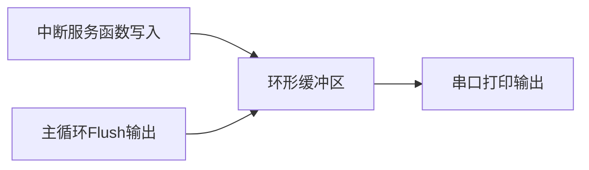

# CHESHI 调试宏统一规范

> 本文件由 SKILL.md 按需加载，描述 CHESHI 调试宏的完整规范。

---

## 强制基础规则

1. **仅使用 `CHESHI`** 作为唯一调试总开关，废弃任何独立分级宏
2. **集中定义**：所有宏定义写在 `main.c` 文件头部，调试结束直接整段删除
3. **优先 Bit 位掩码**（方案A）；项目不支持位运算时用数值分级（方案B）
4. 中断环形缓冲区打印同样统一使用该宏控制
5. 通信层只采集快照/事件，不得直接 `printf`；由 `main` 主循环统一输出
6. **不是只包裹 `printf`**：凡是本轮调试结束后需要删除的新增代码，都必须由 `CHESHI` 条件编译完整包裹
7. 包裹范围包括但不限于：头文件引用、宏定义、常量、类型定义、`extern`/函数声明、全局/静态/局部变量、函数参数、辅助函数、初始化/反初始化、采集与 Flush 调用、错误路径、计数器、缓冲区及业务路径中的临时分支
8. 不得让正式代码依赖临时符号；关闭或删除 `CHESHI` 后必须可独立编译，且不得产生缺失引用、未使用符号或行为变化
9. 如果一个函数签名仅为调试增加参数，调用点、声明和定义必须同步受控；优先改用受控的调试上下文/采集函数，避免污染正式接口

---

## 临时代码完整包裹规则

判断标准只有一个：**这行代码在调试结束时是否需要删除？** 如果需要，就必须放入对应
`#if (CHESHI & mask)` / `#if (CHESHI >= level)` 块中，不能只靠注释标记，也不能裸露在正式代码路径。

### 必须包裹的代码清单

| 类别 | 典型内容 |
|:---|:---|
| 依赖 | 临时 `#include`、外部调试组件头文件 |
| 预处理 | 调试子宏、容量/掩码常量、断言和日志适配宏 |
| 类型与声明 | `typedef`、`struct`、`enum`、函数原型、`extern` 声明 |
| 数据 | 全局、静态、局部临时变量，计数器、快照、环形缓冲区 |
| 接口 | 仅调试所需的函数参数、返回值记录、回调参数和上下文成员 |
| 实现 | 辅助函数、采集器、格式化函数、Flush、初始化和清理函数 |
| 调用 | 采集/打印/Flush 调用、临时分支、错误检测和故障注入逻辑 |
| 工程配置 | 为调试临时增加的 Keil Include Path、Define 或调试源文件 |

### 推荐结构

```c
#define CHESHI  0x03

#if (CHESHI & 0x02)
#include "debug_capture.h"

#define DBG_BUF_SIZE 256U

typedef struct {
    uint16_t length;
    uint32_t timestamp;
} DebugFrameInfo;

static DebugFrameInfo g_debug_frame;
static void Debug_CaptureFrame(const uint8_t *data, uint16_t length);
static void Debug_Flush(void);
#endif
```

使用点同样完整受控：

```c
#if (CHESHI & 0x02)
    Debug_CaptureFrame(frame, frame_length);
#endif

while (1) {
#if (CHESHI & 0x02)
    Debug_Flush();
#endif
    App_Run();
}
```

### 临时参数的处理

禁止只修改函数定义而遗漏声明或调用点。确需增加临时参数时，整个接口变体必须一致受控：

```c
#if (CHESHI & 0x01)
static int ParseFrame(const uint8_t *data, uint16_t length, uint32_t *debug_reason);
#else
static int ParseFrame(const uint8_t *data, uint16_t length);
#endif
```

这种方式会形成两套签名，容易漏改，**仅作为不得已的备选方案**。优先保持正式函数签名不变，
在 `CHESHI` 块内调用独立采集函数，或使用仅在 `CHESHI` 下存在的调试上下文。

### 禁止的不完整包裹

```c
#include "debug_capture.h"       // 错误：临时头文件裸露
static uint32_t debug_count;      // 错误：临时变量裸露

#if (CHESHI & 0x01)
printf("count=%lu\r\n", debug_count); // 只包打印仍不合规
#endif
```

关闭全部位后，预处理器应移除所有临时依赖、符号、存储和执行路径，而不只是停止输出。

---

## 方案A（推荐）：Bit 位掩码

模块化精准控制各模块打印开关。

### main.c 头部定义

```c
/*****************************************
 * 【临时调试宏 - 仅调试阶段启用，正式版本完整删除本段】
 * Bit位分配约定：
 * Bit0(0x01)：通用流程函数入口打印
 * Bit1(0x02)：通信原始帧HEX打印
 * Bit2(0x04)：外设驱动状态打印
 * Bit3(0x08)：业务状态机跳转打印
 *****************************************/
#define CHESHI  0x0F   // 00001111 开启全部模块
```

### 代码中使用

```c
// 通用流程打印 Bit0
#if (CHESHI & 0x01)
    printf("[COMMON] func enter, dataLen=%d\r\n", len);
#endif

// 通信层只记录快照，不在通信路径直接打印
#if (CHESHI & 0x02)
    debug_capture_frame(pucFrame, len);
#endif

// main 主循环统一输出通信原始数据 Bit1
#if (CHESHI & 0x02)
    Debug_Flush();
#endif

// 外设驱动打印 Bit2
#if (CHESHI & 0x04)
    printf("[DRV_FLASH] 操作状态=%d\r\n", flash_status);
#endif

// 状态机跳转打印 Bit3
#if (CHESHI & 0x08)
    printf("[FSM] %s -> %s (event=%d)\r\n", cur_state, next_state, event);
#endif
```

### 灵活切换

```c
#define CHESHI  0x01    // 仅通用流程
#define CHESHI  0x03    // 通用流程 + 通信帧
#define CHESHI  0x00    // 关闭所有调试打印
```

---

## 方案B（备选）：数值分级比较

用于不支持位运算的场景（如某些编译环境）。

### main.c 头部定义

```c
/*****************************************
 * 【临时调试宏 - 上线完整删除本段】
 * 分级规则：
 * CHESHI = 0 ：关闭全部调试打印
 * CHESHI ≥ 1 ：错误、关键异常打印
 * CHESHI ≥ 2 ：常规变量、流程摘要打印
 * CHESHI ≥ 3 ：完整HEX原始数据打印
 *****************************************/
#define CHESHI  3
```

### 代码中使用

```c
// 错误级打印
#if (CHESHI >= 1)
    printf("[ERR] 解析失败，错误码=%d\r\n", err_code);
#endif

// 常规信息打印
#if (CHESHI >= 2)
    printf("[INFO] 寄存器地址=%d 数量=%d\r\n", addr, cnt);
#endif

// 原始数据全量打印
#if (CHESHI >= 3)
    printf("[HEX_DATA] ");
    for(int i=0; i<len; i++) printf("%02X ", pucFrame[i]);
    printf("\r\n");
#endif
```

---

## 统一打印标签格式

所有调试打印使用统一标签前缀，便于日志过滤：

| 标签 | 含义 |
|:---|:---|
| `[COMMON]` | 通用流程入口/出口 |
| `[COMM_RAW]` | 通信原始 HEX 数据 |
| `[DRV_xxx]` | 外设驱动状态 |
| `[FSM]` | 状态机跳转 |
| `[ERR]` | 错误/异常 |
| `[INFO]` | 常规信息 |
| `[HEX_DATA]` | 完整 HEX 数据 |

---

## 中断环形缓冲区

ISR 中禁止直接 `printf`，采用缓冲区中转：

```c
#define DBG_BUF_SIZE 256
uint8_t g_dbg_buf[DBG_BUF_SIZE];
uint16_t g_dbg_wr = 0, g_dbg_rd = 0;

// 中断内写入字节
void USART3_IRQHandler(void) {
#if (CHESHI & 0x02)
    g_dbg_buf[g_dbg_wr++ % DBG_BUF_SIZE] = rx_byte;
#endif
}

// 主循环统一输出
void Debug_Flush(void) {
#if (CHESHI & 0x02)
    while (g_dbg_rd != g_dbg_wr) {
        printf("[COMM_RAW] %02X\r\n", g_dbg_buf[g_dbg_rd++ % DBG_BUF_SIZE]);
    }
#endif
}
```

`Debug_Flush()` 必须在 `main` 主循环或其调用链中执行。不得在 ISR、DMA 回调、
协议接收回调或其它通信底层路径中直接调用 `printf`、`puts` 或阻塞式日志接口。
采集逻辑应尽量短，必要时记录时间戳、事件类型、长度、读写索引、错误码和丢包计数，
由主循环在不影响通信时序的上下文中格式化并输出。



---

## Keil 工程配置

如果编译时 CHESHI 打印无输出，检查 Keil 工程是否定义了 CHESHI 宏：

1. 打开工程选项（Project → Options for Target）
2. C/C++ 选项卡 → Preprocessor Symbols → Define
3. 添加 `CHESHI`（无需值，仅为启用条件编译）

AI 应自动在 Keil 工程配置中添加该定义。

若本轮调试临时增加了 Include Path、预处理 Define、调试专用源文件或链接配置，也必须记入
清理清单；结束时与源码中的临时代码一起恢复，不得只删除 `printf` 或 `#if` 代码块。

---

## 调试结束清理验收

清理必须按“新增项清单”逐项反向删除，并至少确认：

1. 临时头文件引用、子宏、类型、声明、变量、参数、辅助函数和所有调用点均无残留
2. 临时 Keil Define、Include Path、源文件和链接配置均已恢复
3. 正式函数声明、定义和调用签名完全一致
4. 全工作区搜索无本轮调试标签、符号、`TODO debug`、裸调试打印或被注释掉的临时代码
5. 清理后重新编译，确认无新增 Error/Warning，正式业务行为不依赖任何已删除符号
