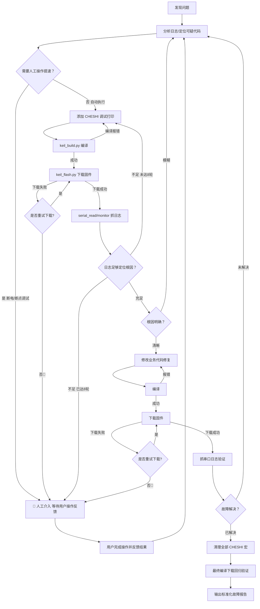

# 核心调试循环

> 本文件由 SKILL.md 按需加载，描述完整的 8 轮迭代调试循环。
> 启动初始化（`--init`）完成后才进入本循环。

---

## 整体流程



---

## 调试打印迭代（核心循环）

### 第 1 步：分析故障

根据串口日志或用户描述，定位可疑代码区域。常见模式：

| 日志特征 | 可疑区域 |
|:---|:---|
| 超时错误 | 通信帧接收/解析函数 |
| CRC 校验失败 | 数据打包/解包逻辑 |
| 卡状态 | 状态机跳转条件 |
| 数据异常 | 缓冲区操作、指针运算 |

### 第 2 步：添加 CHESHI 调试观测

在可疑代码区域插入 `CHESHI` 宏控制的观测点。观测应覆盖入口/出口、关键分支、
长度与索引、错误码、超时/重试、队列或状态机变化，必要时记录原始帧摘要和时间戳。
并非每一步都必须插入调试观测；当当前问题是编译失败、语法错误、工程配置错误、硬件不可用或已能通过现有证据判断时，AI 应优先修复问题或收敛条件，而不是为了“加日志”而强行改代码。
通信层只写入事件/数据快照，主循环统一格式化输出；ISR、DMA回调和协议底层禁止直接 `printf`。
如果现有代码无法提供证据，允许增加临时变量、计数器、快照或环形缓冲区，但不得改变业务协议或阻塞通信路径。

```c
// 通用入口打印
#if (CHESHI & 0x01)
    printf("[SAFE_PARSE] addr=%d cnt=%d\r\n", usRegAddress, usRegCount);
#endif
// 通信层：只采集 RAW 快照，禁止直接打印
#if (CHESHI & 0x02)
    debug_capture_frame(pucFrame, *usLen);
#endif

// main 主循环：统一输出已采集的调试快照
#if (CHESHI & 0x02)
    Debug_Flush();
#endif
```

> **约束**：所有宏定义集中写在 `main.c` 头部，禁止散落各处。
> 参见 `refs/cheshi-macro.md` 获取完整宏规范。

### 第 3 步：编译

```bash
# 增量编译（默认，只编译修改过的文件，速度快）
python scripts/keil_build.py

# 全编译（宏定义无变化时使用，确保所有文件重新编译）
python scripts/keil_build.py --rebuild
```

> **关于编译策略**：
> - **增量编译 `-b`（默认）**：只重新编译修改过的文件，速度快。CHESHI 宏写在 `main.c` 头部时足够可靠。
> - **全编译 `-r`（`--rebuild`）**：先 Clean 再全部重编，耗时较长但更彻底。
> - ⚠️ **何时需要全编译**：修改了工程级宏定义（C/C++ → Define 中的配置）、切换 Target、或发现编译产物与代码不一致时。
> - **调试循环建议**：首次进入调试循环用全编译，后续迭代用增量编译。

- 编译成功 → 进入第 4 步
- 编译失败 → 修正调试代码语法，返回第 2 步

### 第 4 步：下载固件

> ⚠️ JLink 下载器连接状态已在启动阶段确认，此处不再重复询问。

```bash
python scripts/keil_flash.py
```

或一键：

```bash
python scripts/build_and_flash.py
```

#### 下载失败重试

若下载失败（如 `Target DLL has been cancelled`、连接超时等），AI 必须询问用户：

> **AI 询问模板**：
> ```
> ❌ 固件下载失败：{错误信息}
> 是否重试下载？(是/否)
> ```
> - **是** → 重新执行 `keil_flash.py` 下载
> - **否** → 🛑 触发人工暂停，用户排查硬件连接后继续

重试次数不做限制，由用户决定何时放弃。

### 第 5 步：抓取串口日志

```bash
# 单次读取（快速检查）
python scripts/serial_read.py --timeout 3

# 持续监听（捕获完整启动日志）
python scripts/multi_project_runner.py --action serial --config-dir "<工作区>" --modes "<逐项目模式>" --duration 15 --save debug_round_1.log
```

> `--save` 只传日志基础文件名；实际目录和项目独立文件名由
> `scripts/path_config.py` 根据 `scripts/skill-config.json` 生成，禁止在文档中拼接路径。

### 第 6 步：分析日志

检查日志是否包含足够信息定位故障根因：

- 变量值是否符合预期？
- 数据帧内容是否完整？
- 执行路径是否与设计一致？

### 迭代轮次控制

- 每完成一轮（步骤 2→6），轮次计数器 +1
- **最大 8 轮**，达到上限仍未定位 → 🛑 触发人工求助
- 轮次计数器重置条件：用户提供了新的方向性信息

---

## 代码修复阶段

### 定位根因后

1. 修改业务代码（非 CHESHI 调试代码），同时保留与根因直接对应的临时验证检测
2. 验证检测必须能证明修复条件成立，而不是只证明本轮没有复现
3. 编译并下载验证（下载失败时遵循上述重试规则）

```bash
python scripts/build_and_flash.py
python scripts/serial_monitor.py --duration 10
```

### 验证通过后

1. 按本轮新增项清单删除全部 CHESHI 临时代码，包括头文件引用、子宏、类型/声明、变量、参数、辅助函数、采集器、缓冲区、Flush、调用点及验证检测，并恢复临时工程配置
2. 最终编译确认无误
3. 执行 Git 合并（参见 `refs/git-rules.md`）
4. 输出故障解决报告（参见 `templates/report.md`）

---

## 迭代检查清单

每次自动迭代/修复完成后逐项校验，完整清单（含验证方法与验收标准）见 `templates/checklist.md`。

---

## 实战示例：RU2-RU3 TTL 通信故障

| 轮次 | 操作 | 结果 |
|:---|:---|:---|
| 1 | 发现 `0x40000` TTL 超时错误 | Safeguard 协议解析异常 |
| 2 | 添加 Bit1 RAW 帧打印 | 接收数据完整，seqNum 不匹配 |
| 3 | RU2 发送 + RU3 接收同时加打印 | 对比发现 PDU 截断 4 字节 |
| 4 | 定位根因：共享缓冲区覆盖 + 帧长度偏移计算错误 | — |
| 5 | 修复 `mb.c` 长度逻辑 + `mbfuncholding_m.c` 增加缓存 | — |
| 6 | 编译下载 + 持续监听 | 通信正常，无异常错误码 |
| 7 | 删除 main.c 头部 CHESHI 宏，最终编译确认 | ✅ 完成 |
