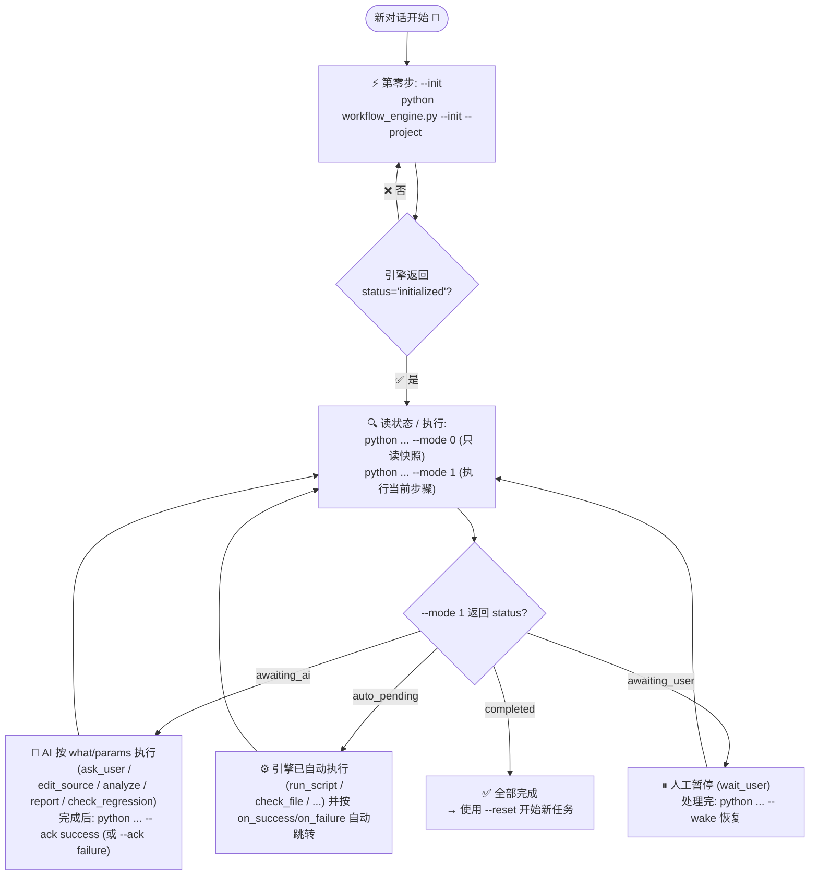
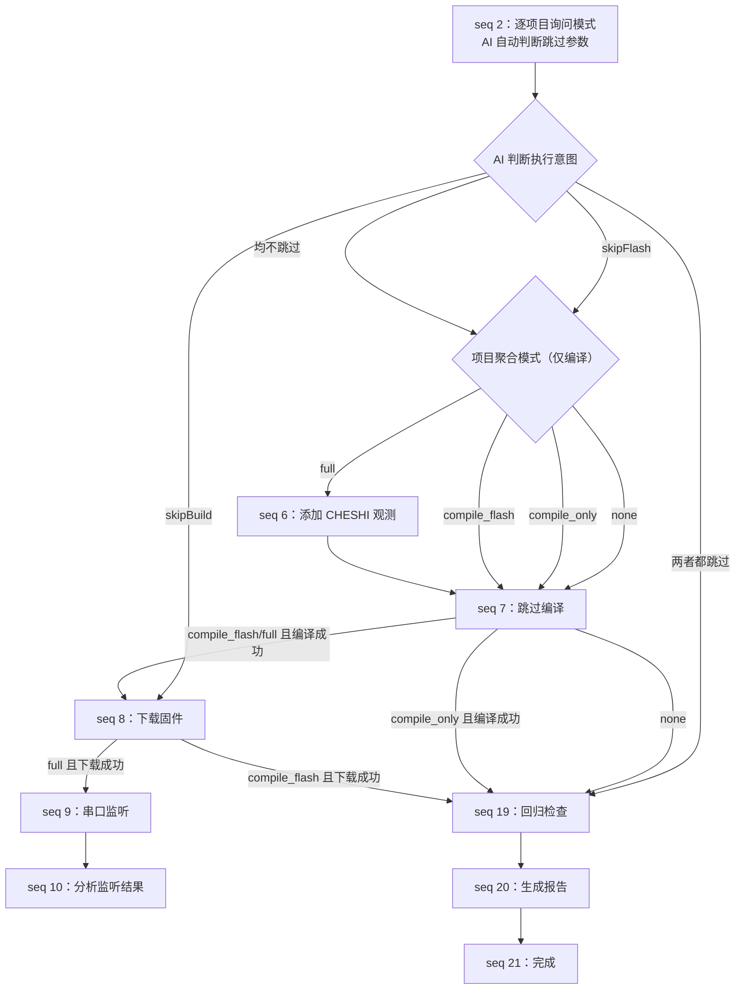
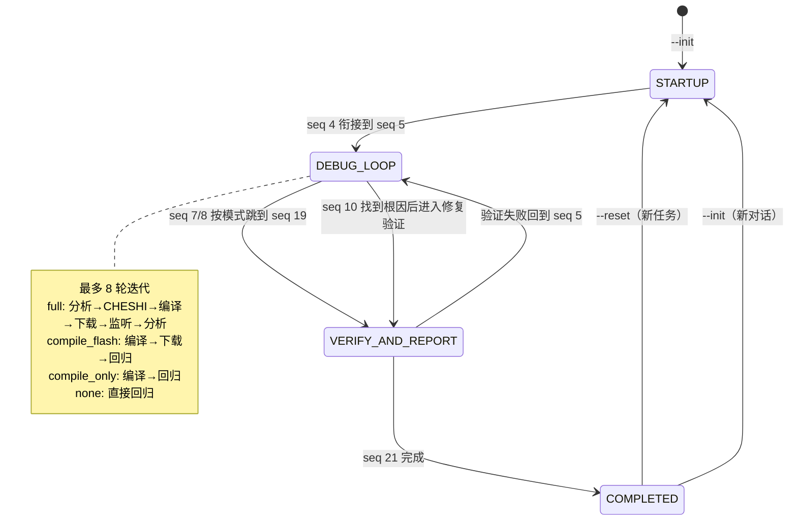

# 嵌入式调试工作流 — 完整运行流程图

> 本文件描述 **AI 与引擎的交互模式** 与 **flow.yaml 的三大阶段序号流程**。
> 所有步骤、跳转、条件都在 `flow.yaml` 中定义，引擎只是按 `seq` 查表执行。

## 1. AI 与引擎交互模式

> 提示：`--done` 是 `--ack success` 的别名；自动步骤无需 `--ack`，引擎已自动推进。

## 2. 三大阶段序号流程（对应 flow.yaml）

> 四种模式必须对 `projects` 中每一个项目分别询问，并分别确认全局参数 `skipBuild`、
> `skipFlash`。`none` 不编译不下载，
> `compile_only` 仅编译，`compile_flash` 编译下载但不监听，`full` 编译下载并监听。

## 3. 整体阶段流转

