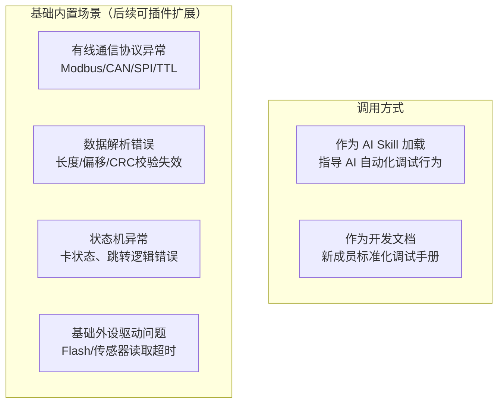
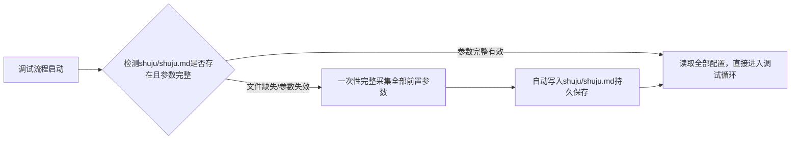
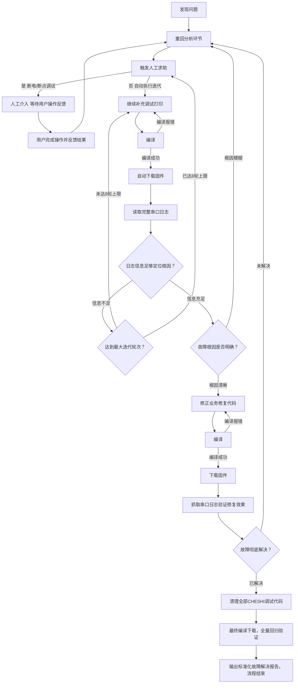
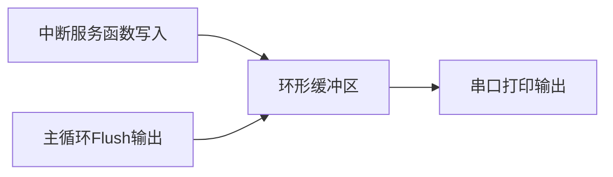
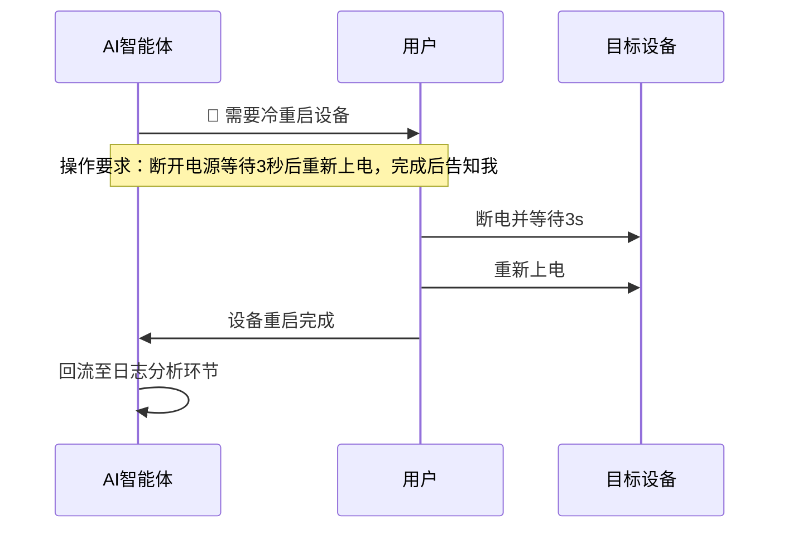
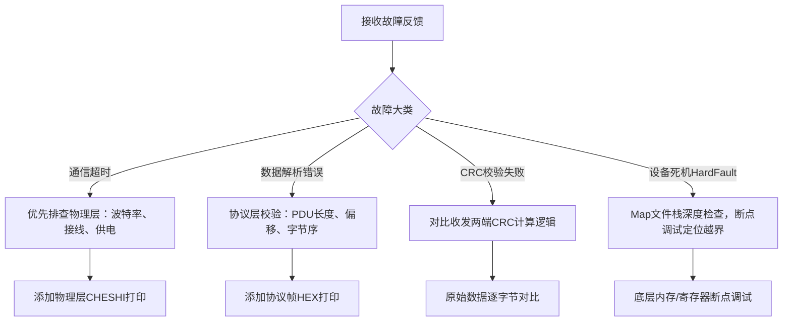
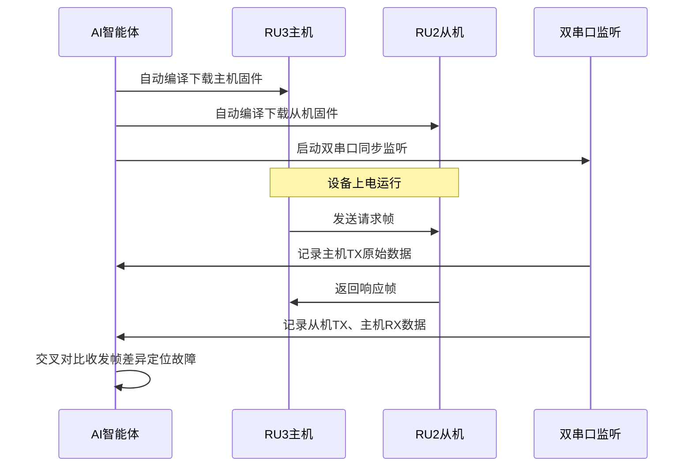
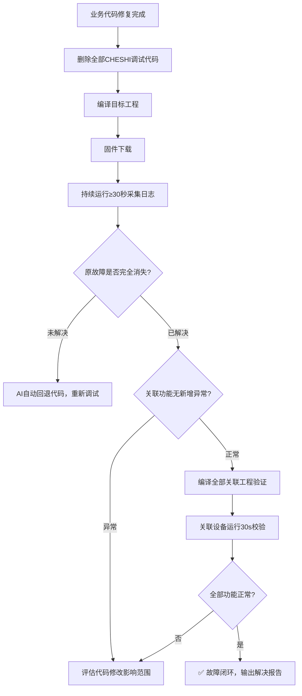

# 嵌入式固件调试工作流指南（优化完整版）
> **定位**：本文档为AI自动化调试Skill基础雏形，既可作为AI执行调试行为的强制规则，也可作为开发人员调试操作手册；新增插件化扩展机制，后续无线、RTOS、内核异常等能力独立新增子文档，不改动本文核心流程。
> 核心覆盖链路：问题发现 → 故障分类诊断 → CHESHI调试打印迭代 → 自动编译下载 → 串口日志解析 → 业务代码修复 → 回归验证 → 输出标准化报告
> 全局硬性约束（全文强制执行，优先级最高）
1. **交互询问规则**
   - 仅调试启动阶段一次性采集全部工程、串口、下载器参数，写入本地配置持久化；运行自动化流程中非必要绝不主动询问用户；
   - 仅3类固定场景触发`🛑人工暂停`（人工操作效率显著高于自动化），其余环节全程静默自动执行；
   - 暂停仅告知用户操作需求，不额外碎片化索要信息。
2. **Git版本管控规则**
   - 全程禁止执行`git push`远程推送，所有分支、提交、回退仅在本地仓库操作；
   - 代码改错、问题恶化需版本回退时，由AI自动执行Git命令完成，无需用户参与；
   - 临时CHESHI调试代码与正式业务修复代码强制隔离，调试分支仅本地创建，不推远端。
3. **调试宏统一规范**
   - 全局仅使用`CHESHI`单一调试总开关，废弃独立`DEBUG_LEVEL`分级体系；
   - 所有宏定义统一集中写在`main.c`头部，调试结束整段删除，无需遍历全文件清理；
   - 优先采用Bit位掩码区分打印模块；兼容备选方案：数值大小分级`CHESHI > 阈值`；仅约束临时调试代码，业务逻辑代码不作改动。
4. **文件路径动态加载规则**
   - 依托AI自有工作区，自动检索Skill同目录`shuju/shuju.md`配置文件，存储Keil工具、工程、串口、下载器全部参数；
   - 配置文件缺失/参数不全时，纳入启动一次性采集流程，采集完成自动写入持久化；
   - 所有PowerShell脚本、Keil编译命令移除硬编码绝对路径，运行时动态读取配置文件参数；路径校验、串口重连等细节问题暂搁置，出现故障后迭代优化。
5. **Skill扩展架构规则**
   - 本文档为固定基础框架，核心流程、交互、Git、宏规则永久不变；
   - 新增以太网/WiFi/LoRa/RTOS/HardFault等专项调试能力时，新建独立子文档`skill_xxx.md`；
   - 所有子文档必须完全遵循本文档全部约束，复用主调试循环逻辑。

## 0. 适用场景与角色


## 1. 工作区初始化 & 一次性前置信息采集（替换原前置信息确认）
### 1.1 目录结构约定（AI自动识别）
```
Skill主目录/
├─ skill.md                # 本核心调试主文档
└─ shuju/                  # 自动生成的数据存储目录
   └─ shuju.md             # 全局持久化配置文件，存储所有动态参数
```
### 1.2 启动执行逻辑

### 1.3 一次性采集清单（启动仅询问一次，后续不再弹窗）
| 采集项目 | 用途说明 |
|------|------|
| Keil工具路径 | UV4.exe完整路径，用于编译下载 |
| 工程根目录 | `.uvprojx`工程文件所在文件夹 |
| Keil工程文件名 | 目标工程`.uvprojx`文件名 |
| 串口基础参数 | 串口号、波特率、数据位/停止位/校验位 |
| 下载器信息 | J-Link/ST-Link序列号（多设备联调必填） |
| 设备标识信息 | 设备角色、设备间物理通信链路 |

### 1.4 shuju.md 标准存储格式（AI自动读写）
```markdown
# 全局调试持久化配置文件
# 生成时间：YYYY-MM-DD HH:mm:ss
## 1. Keil工具路径
Keil_UV4_Path: C:\Keil_v5\UV4\UV4.exe

## 2. 工程列表（支持多工程存储）
Project_1_Name: RU3主机系统工程
Project_1_Dir: e:\文件\代码\ru3_system_management1\MDK-ARM
Project_1_File: RU3.uvprojx

Project_2_Name: RU2从机驱动工程
Project_2_Dir: e:\文件\代码\ad7760-drive\Project\MDK-ARM(AC5)
Project_2_File: project.uvprojx

## 3. 串口调试参数
Serial_Port: COM19
Baud_Rate: 256000
DataBits: 8
StopBits: 1
Parity: None

## 4. 下载器序列号
JLink_SN: 123456

## 5. 设备链路信息
Device_Role: RU3主机
Comm_Link: RU3 USART3 TTL ↔ RU2 USART3 TTL
```

## 2. Git本地版本管理规范（全新章节，禁用远程推送）
### 2.1 基础分支规则
1. 稳定基线：本地`main/master`分支，禁止直接在该分支编写调试代码；
2. 临时调试分支：每次故障独立创建本地分支，命名格式`debug/故障简述_YYYYMMDD`；
3. 红线：全程不执行`git push`，所有修改仅留存本地。

### 2.2 调试全流程Git自动操作（AI自主执行，无需用户操作）
#### 调试开始前（拉取本地基线、创建调试分支）
```powershell
# 切换本地主分支，同步本地最新代码
git checkout main
git pull --no-ff
# 创建并切换专属本地调试分支
git checkout -b debug/ttl_comm_err_20260706
# 校验工作区干净，清理历史残留修改
git status
```
#### 调试打印迭代阶段（隔离CHESHI临时代码）
新增/修改`CHESHI`调试打印仅本地修改，不提交；如需切换验证其他问题，自动暂存调试代码：
```powershell
git stash save "临时调试代码-xxx通信故障"
```
#### 业务代码修复完成（区分正式代码与调试代码）
```powershell
# 快照保存当前全部修改
git add .
git stash save "修复前完整快照"
# 仅提交业务修复代码，过滤所有CHESHI调试内容
git add 目标修复文件.c
git commit -m "fix: 修复xxx故障，根因详细描述"
```
#### 版本回退（AI自动执行，代码改错/故障恶化时触发）
```powershell
# 查看本地提交记录
git log --oneline
# 场景1：保留本地修改，仅回退提交记录
git reset --soft 目标提交ID
# 场景2：彻底丢弃所有本地修改，强制回退至稳定版本
git reset --hard 目标提交ID
```
#### 调试收尾（问题修复，合并本地分支）
1. 删除`main.c`内全部CHESHI调试宏与配套打印代码；
2. 本地合并分支，清理临时调试分支（无远程推送）
```powershell
git checkout main
git merge --no-ff debug/ttl_comm_err_20260706
# 按需删除本地临时分支
git branch -d debug/ttl_comm_err_20260706
```

## 3. 核心调试循环（重构流程图，新增8轮迭代上限防死循环）
整体迭代逻辑：日志分析→自动加打印迭代，仅满足人工操作收益更高时暂停，迭代满8轮强制求助用户。

### 🛑 合规暂停节点说明（仅三类场景允许暂停，其余全程静默）
| 暂停节点 | 触发判定场景 | 用户执行操作 |
|----------|------|---------------|
| 设备断电重启 | 设备死机看门狗失效、底层时钟/启动代码修改、外设锁死无法恢复 | 断开电源等待3秒后重新上电；普通异常优先热复位，不强制断电 |
| Keil断点调试 | 串口打印无法获取变量、寄存器、调用栈，纯日志无法定位逻辑问题 | 按指定文件、行号设置断点，Debug运行后反馈监视窗口变量值 |
| 迭代上限求助 | 自动加打印满8轮仍无法定位故障 | 提供硬件接线、对比正常设备日志、业务逻辑说明等补充信息 |

## 4. 调试打印宏统一规范（删除旧DEBUG_LEVEL体系，双方案适配）
### 4.1 强制基础规则
1. 仅使用`CHESHI`作为唯一调试总开关，废弃独立分级宏；
2. 所有宏定义集中写在`main.c`文件头部，调试结束直接删除整段代码，无残留；
3. 优先使用**Bit位掩码**区分多模块打印；项目不支持位运算时使用数值分级`CHESHI >= 阈值`；
4. 中断环形缓冲区打印同样统一使用该宏控制。

### 4.2 方案A：推荐 Bit位掩码（模块化精准控制打印）
main.c 头部临时宏定义（上线整段删除）
```c
/*****************************************
 * 【临时调试宏 - 仅调试阶段启用，正式版本完整删除本段】
 * Bit位分配约定（注释说明每一位用途）
 * Bit0(0x01)：通用流程函数入口打印
 * Bit1(0x02)：通信原始帧HEX打印
 * Bit2(0x04)：外设驱动状态打印
 * Bit3(0x08)：业务状态机跳转打印
 *****************************************/
#define CHESHI  0x0F   // 00001111 开启全部模块调试打印
```
代码中按位与判断输出打印
```c
// 通用流程打印 Bit0
#if (CHESHI & 0x01)
    printf("[COMMON] func enter, dataLen=%d\r\n", len);
#endif
// 通信原始数据打印 Bit1
#if (CHESHI & 0x02)
    printf("[COMM_RAW] PDU原始数据: ");
    for(int i=0; i<8 && i<len; i++) printf("%02X ", pucFrame[i]);
    printf("\r\n");
#endif
// 外设驱动打印 Bit2
#if (CHESHI & 0x04)
    printf("[DRV_FLASH] 操作状态=%d\r\n", flash_status);
#endif
```
灵活切换示例：
```c
#define CHESHI  0x01    // 仅开启通用流程打印
#define CHESHI  0x03    // 通用流程+通信原始帧打印
#define CHESHI  0x00    // 关闭所有调试打印
```

### 4.3 方案B：备选 数值分级比较（不支持位运算场景使用）
main.c 头部临时宏定义
```c
/*****************************************
 * 【临时调试宏 - 上线完整删除本段】
 * 分级规则：
 * CHESHI = 0 ：关闭全部调试打印
 * CHESHI ≥ 1 ：错误、关键异常打印
 * CHESHI ≥ 2 ：常规变量、流程摘要打印
 * CHESHI ≥ 3 ：完整HEX原始数据打印
 *****************************************/
#define CHESHI  3
```
代码中大小比较判断打印
```c
// 错误级打印
#if (CHESHI >= 1)
    printf("[ERR] 解析失败，错误码=%d\r\n", err_code);
#endif
// 常规信息打印
#if (CHESHI >= 2)
    printf("[INFO] 寄存器地址=%d 数量=%d\r\n", addr, cnt);
#endif
// 原始数据全量打印
#if (CHESHI >= 3)
    printf("[HEX_DATA] ");
    for(int i=0; i<len; i++) printf("%02X ", pucFrame[i]);
    printf("\r\n");
#endif
```

### 4.4 基础打印模板（统一标签格式，方便日志过滤）
```c
#if (CHESHI & 0x01)
    printf("[SAFE_PARSE] addr=%d cnt=%d usLen=%d PDU:", usRegAddress, usRegCount, *usLen);
    for(int _i=0; _i<8 && _i<*usLen; _i++) printf(" %02X", pucFrame[_i]);
    printf("\r\n");
#endif
```

## 5. 编译、下载、串口脚本（移除硬编码路径，动态读取shuju.md配置）
所有脚本不再写死`C:\Keil_v5\UV4\UV4.exe`、`e:\文件\代码\`等绝对路径，运行时自动解析配置文件内参数。
### 5.1 单工程编译脚本
```powershell
# 自动从shuju.md读取Keil路径、工程目录、工程文件名
$keilPath = 解析配置文件("Keil_UV4_Path")
$projDir = 解析配置文件("Project_1_Dir")
$projFile = 解析配置文件("Project_1_File")
Push-Location "$projDir"
cmd /c "`"$keilPath`" -b $projFile -o build_log.txt"
Pop-Location
# 提取编译错误日志
Get-Content "build_log.txt" | Select-String "error" -Context 1,0
```
### 5.2 固件下载脚本
```powershell
$keilPath = 解析配置文件("Keil_UV4_Path")
$projDir = 解析配置文件("Project_1_Dir")
$projFile = 解析配置文件("Project_1_File")
Push-Location "$projDir"
cmd /c "`"$keilPath`" -f $projFile -o flash_log.txt"
Pop-Location
```
### 5.3 一键编译+下载组合脚本
```powershell
$keilPath = 解析配置文件("Keil_UV4_Path")
$projDir = 解析配置文件("Project_1_Dir")
$projFile = 解析配置文件("Project_1_File")
Push-Location "$projDir"
cmd /c "`"$keilPath`" -b $projFile -o build_log.txt && `"$keilPath`" -f $projFile -o flash_log.txt"
Pop-Location
```
### 5.4 串口单次读取脚本（动态读取串口配置）
```powershell
$portName = 解析配置文件("Serial_Port")
$baud = 解析配置文件("Baud_Rate")
$port = New-Object System.IO.Ports.SerialPort $portName, $baud, None, 8, One
$port.ReadTimeout = 3000
$port.Open()
Start-Sleep -Milliseconds 800
$data = $port.ReadExisting()
Write-Host $data
$port.Close()
```
### 5.5 串口持续监听脚本
```powershell
$portName = 解析配置文件("Serial_Port")
$baud = 解析配置文件("Baud_Rate")
$port = New-Object System.IO.Ports.SerialPort $portName, $baud, None, 8, One
$port.Open()
$logFile = "debug_$(Get-Date -Format 'yyyyMMdd_HHmmss').log"
while ($port.IsOpen) {
    $line = $port.ReadLine()
    $ts = Get-Date -Format "HH:mm:ss.fff"
    "$ts $line" | Tee-Object -FilePath $logFile
}
```

## 6. 批量编译下载多工程（动态读取配置内工程列表）
```powershell
# 自动读取shuju.md中全部工程配置，循环编译下载
$projects = 读取配置内全部工程数组
$keilPath = 解析配置文件("Keil_UV4_Path")
foreach ($p in $projects) {
    Write-Host "=== 编译下载 $($p.Name) ==="
    Push-Location "$($p.Dir)"
    cmd /c "`"$keilPath`" -b $($p.File) -o build_log.txt && `"$keilPath`" -f $($p.File) -o flash_log.txt"
    Pop-Location
}
```

## 7. 完整实战调试示例（RU2-RU3 TTL通信故障）
### 第1轮：发现故障
串口日志输出`0x40000` TTL通信超时错误，判定Safeguard协议解析异常
### 第2轮：添加Bit位控制调试打印
```c
// RU3 mbfuncsafeguard_m.c
#if (CHESHI & 0x02)
    g_che_recv_len = len;
    memcpy(g_che_recv_data, data, len);
#endif
```
自动编译下载→读取日志，发现接收数据完整，但序列号seqNum不匹配
### 第3轮：补充多模块打印
分别在RU2发送、RU3接收处增加通信RAW打印，抓取完整帧数据
### 第4轮：定位根因
日志对比发现PDU数据截断4字节，共享缓冲区覆盖、帧长度偏移计算错误
### 第5轮：修复业务代码
1. RU2 `mb.c` 修正Safeguard帧长度计算逻辑
2. RU3 `mbfuncholding_m.c` 增加请求参数缓存，防止缓冲区覆盖
3. 隔离RS485/TTL收发队列
### 第6轮：自动化回归验证
编译下载，持续监听串口，通信数据正常，无异常错误码
### 第7轮：清理调试代码
删除main.c内全部CHESHI宏定义，移除所有调试打印，最终编译确认

## 8. 故障解决报告模板（保留不变）
```markdown
## 问题描述
[简洁描述故障现象、复现条件]
## 根因分析
[底层根本原因，代码/硬件/协议维度说明]
## 修改文件清单
| 文件路径 | 修改内容简述 |
|------|----------|
| `xxx.c` | xxx逻辑修复 |
## 修改原理说明
[详细解释修改逻辑，规避同类问题]
## 验证结果
[关键串口日志、数据截图、无报错证明]
## 影响范围
- [ ] 仅当前故障通信链路
- [ ] 不影响其他外设/通信功能
- [ ] 需要同步修改关联工程
```

## 9. 迭代检查清单（保留不变）
每次自动迭代/修复完成后自动校验：
- [ ] 串口参数与shuju.md配置一致
- [ ] 编译输出0 Error、无阻塞性Warning
- [ ] 固件下载成功，日志存在预期调试打印
- [ ] 调试打印信息可支撑故障定位
- [ ] 业务修改仅影响目标模块，无连锁副作用
- [ ] 修复完成后已全部清理CHESHI调试代码
- [ ] 最终版本编译下载正常通过

## 10. 常见故障速查表（保留不变）
| 故障现象 | 根因 | 解决方式 |
|------|------|------|
| COM端口拒绝访问 | 串口被其他工具占用 | 关闭多余串口监听程序 |
| 串口输出乱码 | 波特率不匹配/系统时钟配置错误 | 核对shuju.md波特率参数，校验芯片时钟 |
| 修改代码编译无变化 | 目标文件未重新构建 | 删除工程`.o`中间文件重新编译 |
| CHESHI打印无输出 | Keil工程未配置CHESHI宏 | 自动在工程Define中添加CHESHI标识 |

## 11. 中断环形缓冲区调试打印（统一使用CHESHI宏）
ISR中禁止直接printf，采用缓冲区中转，全部由CHESHI控制开关
```c
#define DBG_BUF_SIZE 256
uint8_t g_dbg_buf[DBG_BUF_SIZE];
uint16_t g_dbg_wr = 0, g_dbg_rd = 0;

// 中断内写入字节
void USART3_IRQHandler(void) {
#ifdef CHESHI
    g_dbg_buf[g_dbg_wr++ % DBG_BUF_SIZE] = rx_byte;
#endif
}
// 主循环统一输出
void Debug_Flush(void) {
#ifdef CHESHI
    while (g_dbg_rd != g_dbg_wr) {
        printf("%02X ", g_dbg_buf[g_dbg_rd++ % DBG_BUF_SIZE]);
    }
#endif
}
```


## 12. J-Link Commander底层调试（串口失效场景）
脚本自动读取配置内J-Link序列号、芯片型号，无需手动填写
```powershell
$jlinkSn = 解析配置文件("JLink_SN")
& "C:\Program Files\SEGGER\JLink\JLink.exe" -device STM32H753ZI -if SWD -speed 4000 -autoconnect 1
```
### 常用底层调试命令
| 命令 | 功能 | 使用示例 |
|------|------|------|
| mem32 地址,长度 | 读取32位内存数据 | mem32 0x24000000, 16 |
| mem8 地址,长度 | 读取单字节内存 | mem8 0x24000000, 64 |
| h | 暂停CPU查看寄存器 | h |
| g | 恢复设备运行 | g |
| r | 硬件复位设备 | r |
| w4 地址,数值 | 写入32位测试值 | w4 0x24000000, 0x1234 |

## 13. Keil Map文件自动化分析（栈溢出、内存排查）
```powershell
# 检索目标函数符号
Get-Content "*.map" | Select-String "mbSafeguardParse_m|eMBMasterPoll"
# 检索全局变量地址
Get-Content "*.map" | Select-String "ErrorCode|sa_MetaQueue"
# 检索调用栈深度，判断栈溢出风险
Get-Content "*.map" | Select-String "Call Chain" -Context 0,2
```
### Map文件关键信息用途
| 信息区域 | 作用 |
|----------|-------------|
| Global Symbols 全局符号 | 定位函数、变量地址，设置断点 |
| Call Chain 调用栈 | 校验最大栈深度，规避HardFault栈溢出 |
| Memory Map 内存分布 | 统计RAM/Flash占用率，判断内存不足 |
| Removing 优化移除符号 | 确认变量是否被编译器优化，断点失效排查 |

## 14. 人工暂停场景完整操作规范（仅三类，运行期无额外提问）
### 14.1 设备断电重启流程

触发场景：设备卡死看门狗失效、启动/时钟代码修改、Flash外设锁死。

### 14.2 Keil断点调试标准化请求格式
```markdown
🛑 需要断点调试
目标文件：mbfuncholding_m.c
目标函数：eMBMasterFuncReadHoldingRegister
断点行号：325行
待查看变量：usRegCount、usRegAddress、pucFrame[0~5]
操作步骤：
1. Ctrl+F5进入Debug模式
2. 光标定位325行，F9添加断点
3. F5全速运行至断点触发
4. 将Watch窗口内变量数值反馈给AI
```
配套Keil Debug快捷键：
| 快捷键 | 功能 |
|--------|------|
| Ctrl+F5 | 进入Debug调试模式 |
| F5 | 全速运行程序 |
| F10 | 单步跳过函数 |
| F11 | 单步进入函数内部 |
| F9 | 切换断点开关 |

### 14.3 迭代上限求助（满8轮无进展）
AI一次性告知全部已有信息、缺失信息、需要用户提供的内容，不碎片化提问。

## 15. 硬件故障快速排查速查表（保留不变）
| 硬件操作 | 执行方法 | 注意事项 |
|------|------|----------|
| 断电冷重启 | 断开电源线静置3秒后上电 | 禁止固件下载过程中断电 |
| ISP烧录模式 | BOOT0引脚拉高后复位 | 芯片锁死恢复专用 |
| 供电校验 | 万用表测量VCC-GND电压 | 标准3.3V ±0.1V |
| J-Link连接修复 | 降低SWD通信速度至100kHz | 排查SWCLK/SWDIO/GND接线 |

## 16. 故障分类快速诊断树（保留不变）
收到故障先分类，避免盲目添加打印：

### 错误码速查
| 错误码 | 故障含义 | 优先排查项 |
|--------|------|----------|
| `0x40000` | TTL通信超时 | 设备在线状态、帧格式、波特率 |
| `except=3` | 非法寄存器地址/数量 | Modbus请求参数范围校验 |
| Wait Busy Timeout | Flash外设忙死锁 | QSPI时钟、Flash异常状态 |
| HardFault | 硬件内存异常 | 空指针、数组越界、栈溢出 |

## 17. 日志标准化分析方法（保留不变）
1. **对比法**：同时抓取正常设备与故障设备日志，过滤统一标签后逐行对比差异；
2. **HEX手工解析**：按协议帧头拆分seqNum、PDU、CRC分段校验；
3. **时间线阻塞分析**：按日志时间戳计算事件间隔，定位代码阻塞点。

## 18. 多设备联调流程（双串口同时监听，动态读取配置串口参数）


## 19. 修复后回归验证流程（保留不变）


## 20. PowerShell快捷函数（加载至本地配置，动态读取配置文件）
```powershell
# 永久加载函数，自动读取shuju.md配置
# 编译工程快捷函数
function Build-Keil {
    param($projIndex=1)
    $keilPath = 解析配置("Keil_UV4_Path")
    $dir = 解析配置("Project_$projIndex" + "_Dir")
    $file = 解析配置("Project_$projIndex" + "_File")
    Push-Location "$dir"
    cmd /c "`"$keilPath`" -b $file -o build_log.txt"
    Get-Content "build_log.txt" -Tail 5
    Pop-Location
}
# 下载固件快捷函数
function Flash-Keil {
    param($projIndex=1)
    $keilPath = 解析配置("Keil_UV4_Path")
    $dir = 解析配置("Project_$projIndex" + "_Dir")
    $file = 解析配置("Project_$projIndex" + "_File")
    Push-Location "$dir"
    cmd /c "`"$keilPath`" -f $file -o flash_log.txt"
    Pop-Location
}
# 串口监听快捷函数
function Watch-Serial {
    param($prefix="LOG")
    $port = 解析配置("Serial_Port")
    $baud = 解析配置("Baud_Rate")
    $p = New-Object System.IO.Ports.SerialPort $port, $baud, None, 8, One
    $p.Open()
    while($p.IsOpen){ Write-Host "[$Prefix] $($p.ReadLine())" }
}
```

## 21. 插件化扩展规范（文末新增，指导后续新增功能）
1. 本文档`skill.md`为基础稳定框架，核心流程、交互、Git、宏规则永久不改动；
2. 新增无线通信、RTOS任务调试、HardFault内核异常、低功耗、远程调试等能力时，新建独立子文档`skill_xxx.md`；
3. 所有子文档必须完全遵循本文档全部硬性约束：
   - 仅启动一次性采集参数，运行期不随意询问；
   - 调试代码统一使用main.c内CHESHI位掩码/分级宏；
   - Git操作仅本地执行，禁止远程push；
   - 仅三类合规人工暂停场景，其余自动化静默执行；
   - 脚本全部动态读取`shuju/shuju.md`路径参数，无硬编码。